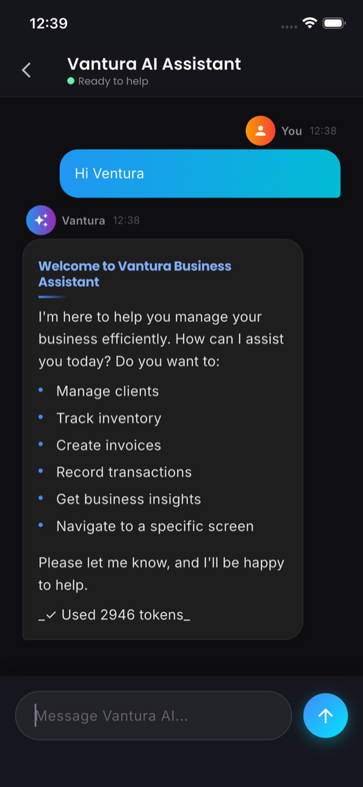

# Orbit - Vantura Agentic AI Framework Example

[](https://flutter.dev)
[](https://dart.dev)
[](https://www.datadaur.com/vantura)

Orbit is an **official example project** for the **Vantura Agentic AI Framework**, demonstrating how to build AI-powered Flutter applications using Clean Architecture. This business management suite integrates intelligent AI agents capable of handling client management, inventory tracking, invoicing, and financial operations through natural language interactions.

## Screenshots



## Table of Contents

- [Screenshots](#screenshots)
- [Architecture](#architecture)
- [Technologies](#technologies)
- [Prerequisites](#prerequisites)
- [Installation](#installation)
- [Configuration](#configuration)
- [Usage](#usage)
- [API and Tools](#api-and-tools)
- [Development](#development)
- [Contributing](#contributing)
- [License](#license)

## Features

### 🤖 AI-Powered Business Management
- **Intelligent Chat Interface**: Natural language interactions with AI agents
- **Automated Business Operations**: AI-driven client onboarding, inventory management, and invoicing
- **Context-Aware Responses**: Agents understand business context and provide relevant insights

### 🏢 Complete Business Suite
- **Client Management**: Add, update, delete, and search clients
- **Inventory Tracking**: Real-time stock management with low-stock alerts
- **Invoice Generation**: Automated invoice creation with tax calculations
- **Financial Ledger**: Transaction recording and financial reporting
- **Analytics Dashboard**: Business metrics and performance insights

### 🏗️ Technical Excellence
- **Clean Architecture**: Strictly separated layers for maintainability
- **Dependency Injection**: Riverpod-based DI for testability
- **Local Persistence**: SQLite database with migration support
- **Responsive Design**: Cross-platform Flutter UI
- **Type Safety**: Full Dart type safety with null-safety

## Architecture

Orbit implements **Clean Architecture** with clear separation of concerns:

```
lib/
├── core/                    # Shared utilities and cross-cutting concerns
│   ├── router/             # Navigation configuration
│   └── utils/              # Logging, constants, helpers
├── data/                   # Data access layer
│   ├── database/          # SQLite implementation
│   ├── models/            # Data transfer objects
│   ├── data_sources/      # External API clients
│   └── repositories/      # Repository implementations
├── domain/                 # Business logic layer
│   ├── entities/          # Domain models
│   ├── repositories/      # Abstract data interfaces
│   ├── use_cases/         # Application business rules
│   └── tools/             # AI agent tools
└── presentation/          # UI layer
    ├── providers/         # State management (Riverpod)
    ├── screens/           # UI screens
    └── widgets/           # Reusable UI components
```

### Key Architectural Patterns

- **Repository Pattern**: Abstract data access with concrete implementations
- **Provider Pattern**: State management and dependency injection
- **Use Case Pattern**: Encapsulated business logic
- **Tool Pattern**: Modular AI agent capabilities

## Technologies

### Core Framework
- **Flutter 3.0+**: Cross-platform UI framework
- **Dart 3.0+**: Programming language with sound null-safety

### AI & Agent Framework
- **[Vantura SDK](https://pub.dev/packages/vantura)**: Agentic AI framework for intelligent agents
- **Vantura Tools**: Modular tool system for agent capabilities
- **Groq API**: High-performance LLM inference

### State Management & DI
- **Riverpod**: Reactive state management and dependency injection
- **Flutter Riverpod**: Flutter-specific Riverpod extensions

### Data & Persistence
- **SQLite**: Local database for offline-first functionality
- **sqflite**: Flutter SQLite plugin with migrations

### Navigation & UI
- **Go Router**: Declarative routing with deep linking
- **Google Fonts**: Typography for consistent branding

### Development Tools
- **flutter_dotenv**: Environment variable management
- **flutter_lints**: Code quality and consistency
- **build_runner**: Code generation for Riverpod

## Prerequisites

Before running Orbit, ensure you have:

- **Flutter SDK** >= 3.0.0
- **Dart SDK** >= 3.0.0
- **Android Studio** or **VS Code** with Flutter extensions
- **Git** for version control
- **Groq API Key** for AI functionality

### System Requirements
- **iOS**: macOS with Xcode 14+
- **Android**: Android Studio with Android SDK
- **Web**: Chrome browser for web development

## Installation

### 1. Clone Repository
```bash
git clone https://github.com/tayyabmughal676/orbit-vantura-example.git
cd orbit-vantura-example
```

### 2. Install Dependencies
```bash
flutter pub get
```

### 3. Verify Installation
```bash
flutter doctor
```

## Configuration

### Environment Setup
Create a `.env` file in the project root:

```env
# Vantura AI Configuration
GROQ_API_KEY=your_groq_api_key_here
BASE_URL=https://api.groq.com
MODEL=llama-3.3-70b-versatile

# Optional: Custom configurations
LOG_LEVEL=debug
DATABASE_PATH=orbit.db
```

### API Key Setup
1. Sign up at [Groq Console](https://console.groq.com)
2. Generate an API key
3. Add the key to your `.env` file

### Build Configuration
The app supports multiple build flavors:

```bash
# Development
flutter run --flavor development

# Staging
flutter run --flavor staging

# Production
flutter run --flavor production
```

## Usage

### Running the Application
```bash
# Run on connected device/emulator
flutter run

# Run on specific platform
flutter run -d android
flutter run -d ios
flutter run -d chrome
```

### Core Workflows

#### 1. Client Management
Users can interact with the AI agent to:
- Add new clients: *"Add a new client named John Doe with email john@example.com"*
- Update client information: *"Update John's phone number to 555-0123"*
- Search clients: *"Find all clients from New York"*

#### 2. Inventory Operations
- Add products: *"Add 50 units of Widget X at $10 each"*
- Track stock: *"How many Widget X do we have left?"*
- Low stock alerts: *"Which items are running low?"*

#### 3. Invoice Generation
- Create invoices: *"Create an invoice for John Doe for 10 Widget X"*
- Status updates: *"Mark invoice #123 as paid"*
- Financial reporting: *"What's our total income this month?"*

### AI Agent Interaction

The Vantura agent understands natural language and can:
- Process complex multi-step operations
- Ask for confirmation on sensitive actions
- Provide contextual help and suggestions
- Maintain conversation history for continuity

## API and Tools

Orbit integrates **Vantura Tools** - modular capabilities for AI agents:

### Business Tools
- `CreateClientTool`: Client onboarding
- `UpdateClientTool`: Client information updates
- `DeleteClientTool`: Client removal
- `ListClientsTool`: Client directory access

- `CreateInventoryItemTool`: Product catalog management
- `UpdateInventoryItemTool`: Stock level updates
- `ListInventoryTool`: Inventory overview
- `DeleteInventoryItemTool`: Product removal

- `CreateInvoiceTool`: Invoice generation
- `ListInvoicesTool`: Invoice management
- `UpdateInvoiceStatusTool`: Payment processing

- `CreateLedgerEntryTool`: Financial transaction recording
- `ListLedgerEntriesTool`: Transaction history
- `DeleteLedgerEntryTool`: Transaction removal

- `GetStatsTool`: Business analytics and reporting

### Technical Implementation

Each tool extends `VanturaTool<T>` and implements:
- **Parameter Schema**: JSON Schema for input validation
- **Execution Logic**: Business logic with error handling
- **Confirmation Flow**: Sensitive operations require user approval
- **Logging**: Comprehensive operation tracking

Tools are injected with repository dependencies, ensuring:
- **Testability**: Mock repositories for unit testing
- **Flexibility**: Easy swapping of data sources
- **Separation of Concerns**: Business logic isolated from data access

## Development

### Project Structure Details

```
lib/
├── core/
│   ├── router/app_router.dart          # Go Router configuration
│   └── utils/
│       ├── logger.dart                 # AppLogger with Vantura integration
│       └── logging_config.dart         # Logging configuration
├── data/
│   ├── database/
│   │   ├── database_helper.dart        # SQLite setup and migrations
│   │   └── persistent_memory_impl.dart # Vantura memory persistence
│   └── repositories/
│       ├── client_repository_impl.dart
│       ├── inventory_repository_impl.dart
│       ├── invoice_repository_impl.dart
│       └── ledger_repository_impl.dart
├── domain/
│   ├── entities/                       # Pure domain models
│   │   ├── client.dart
│   │   ├── inventory_item.dart
│   │   ├── invoice.dart
│   │   └── ledger_entry.dart
│   ├── repositories/                   # Abstract contracts
│   │   ├── client_repository.dart
│   │   ├── inventory_repository.dart
│   │   ├── invoice_repository.dart
│   │   └── ledger_repository.dart
│   ├── use_cases/
│   │   └── chat_service.dart           # AI agent orchestration
│   └── tools/
│       └── business_tools.dart         # AI agent capabilities
└── presentation/
    ├── providers/
    │   ├── business_providers.dart     # Riverpod providers
    │   └── chat_provider.dart          # Chat state management
    ├── screens/
    │   ├── chat_screen.dart
    │   ├── dashboard_screen.dart
    │   ├── clients_screen.dart
    │   ├── inventory_screen.dart
    │   ├── invoicing_screen.dart
    │   └── ledgers_screen.dart
    └── widgets/                        # Shared UI components
```

### Development Workflow

#### Code Generation
```bash
# Generate Riverpod providers
flutter pub run build_runner build

# Watch for changes
flutter pub run build_runner watch
```

#### Testing Strategy
```bash
# Run all tests
flutter test

# Run with coverage
flutter test --coverage

# Integration tests
flutter test integration_test/
```

#### Code Quality
```bash
# Lint code
flutter analyze

# Format code
dart format lib/

# Build for production
flutter build apk --release
flutter build ios --release
```

### Database Schema

Orbit uses SQLite with the following main tables:
- `clients`: Client information
- `inventory`: Product catalog and stock levels
- `invoices`: Invoice headers and line items
- `ledger_entries`: Financial transactions

Migrations are handled through `DatabaseHelper` with version-based upgrades.

### AI Integration Details

The Vantura agent is configured with:
- **Custom Instructions**: Business-specific prompt engineering
- **Tool Registry**: Dynamic tool loading and execution
- **Memory System**: Persistent conversation context
- **Error Handling**: Comprehensive failure recovery
- **Logging Integration**: Full observability with AppLogger

## Contributing

We welcome contributions to Orbit! This project serves as a reference implementation for Vantura integrations.

### Development Setup
1. Fork the repository
2. Create a feature branch: `git checkout -b feature/your-feature`
3. Make your changes with tests
4. Run the full test suite: `flutter test`
5. Submit a pull request

### Guidelines
- Follow Clean Architecture principles
- Write comprehensive unit tests
- Update documentation for API changes
- Ensure cross-platform compatibility
- Use meaningful commit messages

### Areas for Contribution
- Additional AI tools and capabilities
- UI/UX improvements
- Performance optimizations
- Multi-platform support enhancements
- Documentation improvements

## License

This project is licensed under the BSD-3-Clause License - see the [LICENSE](https://pub.dev/packages/vantura/license) for details.

## Acknowledgments

- **[Vantura Team](https://www.datadaur.com/vantura)**: For the revolutionary Agentic AI Framework
- **Flutter Team**: For the incredible cross-platform framework
- **Open Source Community**: For the tools and libraries that make this possible

---

**Built with ❤️ using the Vantura Agentic AI Framework**

For more information about Vantura, visit [datadaur.com/vantura](https://www.datadaur.com/vantura)


